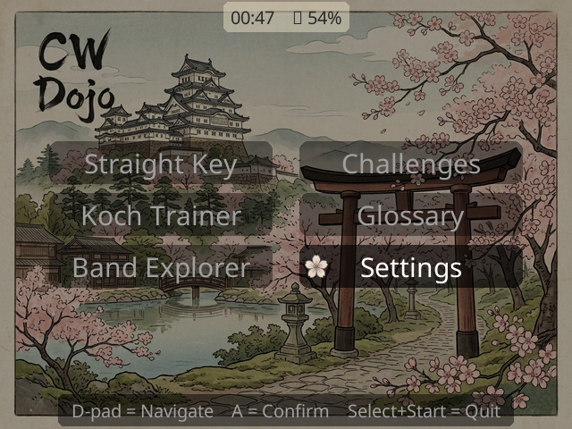
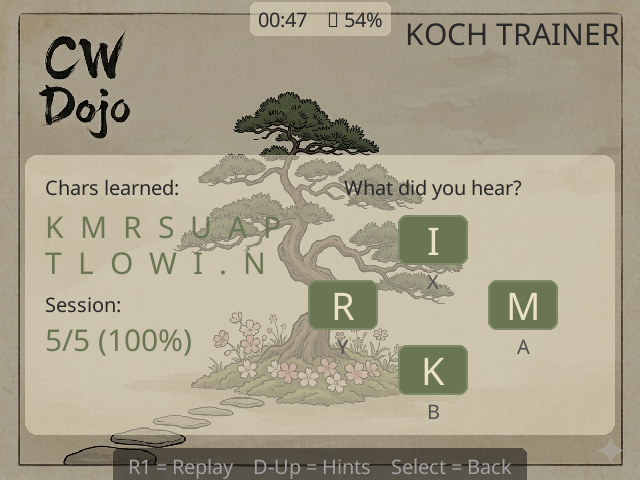
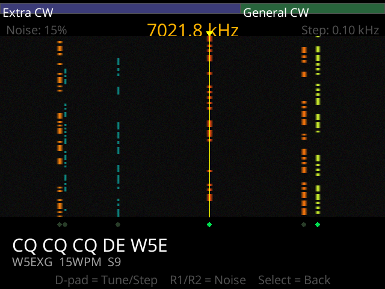
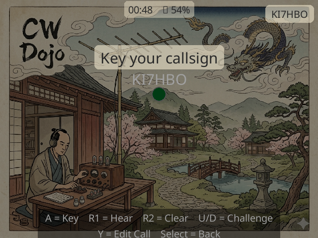
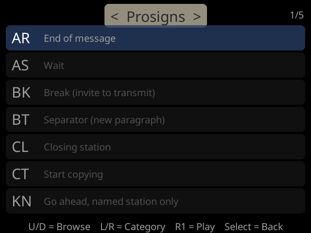

# CW Dojo

A Morse code (CW) trainer designed for the R36S handheld game console running ROCKNIX. Built with Python and pygame.

Learn CW the way you'd learn a language — through drills, listening, and practice on a device that fits in your pocket.

## Screenshots

| | | |
|:---:|:---:|:---:|
|  |  |  |
| Main Menu | Koch Trainer | Band Explorer |
|  |  | |
| Straight Key | Glossary | |

## Features

**Straight Key** — Practice sending with the A button as a straight key. Hear your sidetone, see your dits and dahs decoded in real time.

**Iambic Keyer** — Plug in a CW paddle via the 3.5mm jack (or use L1/R1 on the gamepad) for iambic A/B keying with adjustable speed.

**Send Drill** — Graded send practice. Key a target letter, word, abbreviation, or callsign and get scored on accuracy *and* timing quality — dah length, dit consistency, and letter spacing — with elmer-style tips like "Dahs too short, hold for 3 dits."

**Koch Trainer** — Receive practice using the Koch method with spaced repetition. Characters you struggle with appear more often. Toggle hints (D-pad Up) to see dit/dah patterns while learning. Progress persists between sessions.

**Band Explorer** — Simulated HF waterfall display. Tune across a 40m CW band segment with D-pad, hear stations calling CQ and having QSOs. Realistic band noise with atmospheric fading and static.

**Vocabulary Quiz** — Timed drills on common CW abbreviations and Q-codes. Listen to a CW phrase, pick the correct meaning.

**QSO Procedure Trainer** — Practice full QSO exchanges: CQ calls, signal reports, and common ragchew elements. Hear the expected exchange, then key your response.

**Glossary** — Browse common CW abbreviations, prosigns, Q-codes, and typical QSO phrases. Press R1 to hear any term played as CW.

**Profiles** — Multiple user profiles so you can share the device. Each profile tracks its own Koch progress independently.

**Settings** — Adjust sidetone frequency, character speed (WPM), Farnsworth spacing, master volume, and key sound style.

## Controls (R36S)

| Button | Function |
|--------|----------|
| D-pad | Navigate menus, tune waterfall, adjust WPM |
| A | Confirm, straight key, start round |
| B | Answer choice (Koch) |
| X | Answer choice (Koch), delete (callsign editor) |
| Y | Answer choice (Koch), edit callsign |
| L1 | Dit paddle / straight key (jack tip) |
| R1 | Dah paddle in iambic mode (jack ring); play/hear audio otherwise |
| D-pad Left | Hear the target while keying |
| L2 | Take screenshot |
| Select | Back to menu |
| Select+Start | Quit to EmulationStation |

## Controls (Desktop/Keyboard)

| Key | Function |
|-----|----------|
| Arrow keys | D-pad equivalent |
| Space | Straight key |
| W/D/S/A | X/A/B/Y face buttons |
| R | Replay / play audio |
| H | Toggle hints (Koch) |
| F12 | Take screenshot |
| Escape | Back to menu |
| Q | Quit |

## Requirements

- Python 3.10+
- pygame (or pygame-ce) >= 2.5
- numpy >= 1.24

## Running on Desktop (Development)

```bash
git clone https://github.com/DavidClawson/cw-dojo.git
cd cw-dojo
```

With [uv](https://docs.astral.sh/uv/):

```bash
uv run python main.py
```

With pip:

```bash
pip install -r requirements.txt
python main.py
```

## Installing on R36S (ROCKNIX)

### Prerequisites

- R36S running ROCKNIX
- WiFi dongle connected and configured
- SSH access to the device

### Install Steps

1. **Install Python packages** on the device:

   ```bash
   # From your computer, download aarch64 wheels
   pip download --only-binary=:all: --platform manylinux2014_aarch64 \
     --python-version 3.11 --implementation cp pygame numpy -d /tmp/wheels/

   # Copy to device
   scp /tmp/wheels/*.whl root@<device-ip>:/tmp/

   # SSH in and install
   ssh root@<device-ip>
   mkdir -p /storage/lib/python3.11/site-packages
   cd /tmp
   python3 -c "
   import zipfile
   site = '/storage/lib/python3.11/site-packages'
   for whl in ['pygame-*.whl', 'numpy-*.whl']:
       import glob
       for f in glob.glob(whl):
           print(f'Installing {f}...')
           zipfile.ZipFile(f).extractall(site)
   "
   ```

   Then symlink system SDL2 over the bundled versions (ROCKNIX's SDL2 has the correct display drivers):

   ```bash
   cd /storage/lib/python3.11/site-packages/pygame.libs/
   ln -sf /usr/lib/libSDL2-2.0.so.0 libSDL2-*.so.*
   ln -sf /usr/lib/libSDL2_image-2.0.so.0 libSDL2_image-*.so.*
   ln -sf /usr/lib/libSDL2_mixer-2.0.so.0 libSDL2_mixer-*.so.*
   ln -sf /usr/lib/libSDL2_ttf-2.0.so.0 libSDL2_ttf-*.so.*
   ```

2. **Copy CW Dojo** to the device:

   ```bash
   scp -r cw-dojo/ root@<device-ip>:/storage/roms/ports/morse_trainer/
   ```

3. **Create the launch script**:

   ```bash
   ssh root@<device-ip>
   cat > '/storage/roms/ports/CW Dojo.sh' << 'EOF'
   #!/bin/bash
   . /etc/profile
   export PYTHONPATH=/storage/lib/python3.11/site-packages
   cd /storage/roms/ports/morse_trainer
   python3 main.py > /tmp/cwdojo.log 2>&1
   EOF
   chmod +x '/storage/roms/ports/CW Dojo.sh'
   ```

4. **Restart EmulationStation** — CW Dojo will appear under Ports.

### Updating

CW Dojo ships with a self-updater (`update.py`) that downloads the latest
release from GitHub and installs it in place — settings and training
progress are preserved. Create a launcher for it once:

```bash
ssh root@<device-ip>
cat > '/storage/roms/ports/CW Dojo Update.sh' << 'EOF'
#!/bin/bash
. /etc/profile
export PYTHONPATH=/storage/lib/python3.11/site-packages
cd /storage/roms/ports/morse_trainer
python3 update.py > /tmp/cwdojo-update.log 2>&1
EOF
chmod +x '/storage/roms/ports/CW Dojo Update.sh'
```

"CW Dojo Update" then appears under Ports — launch it whenever the WiFi
dongle is plugged in to pull the newest release. No computer needed.

## Project Structure

```
cw-dojo/
  main.py         Entry point and scene dispatcher
  audio.py        Sidetone and CW character playback (numpy + pygame)
  band.py         Simulated HF band with CW stations
  buttons.py      R36S button mapping constants
  glossary.py     CW abbreviations, Q-codes, and prosigns
  grading.py      Send-quality timing analysis for the send drill
  keyer.py        Iambic keyer logic (Mode A/B)
  koch.py         Koch method trainer with spaced repetition
  morse.py        Morse code table, decoder, and Koch character order
  profiles.py     Multi-user profile management
  progress.py     Persistent Koch training progress
  qso_scripts.py  QSO exchange templates and scripts
  scenes.py       All scene classes (menu, straight key, Koch, etc.)
  settings.py     Persistent user settings
  sounds.py       UI sound effects
  ui.py           Display rendering for all screens
  update.py       On-device self-updater (pulls latest GitHub release)
  vocab_quiz.py   Vocabulary quiz scene
  waterfall.py    Waterfall display and band explorer scene
  assets/         Fonts, background images, and sound effects
```

## PortMaster Package

The `portmaster/` directory contains a standalone build of CW Dojo packaged for [PortMaster](https://portmaster.games/). To rebuild it (syncs the package from the main source, then produces `cw.dojo.zip`):

```bash
scripts/build_portmaster.sh
```

A GitHub Action runs this on every push and attaches `cw.dojo.zip` to the release when a `v*` tag is pushed.

## Hardware

### What You Need

To run CW Dojo on an R36S, you'll need:

| Item | Notes |
|------|-------|
| **R36S handheld** | The RK3326 model running ROCKNIX. ~$35 on Amazon. |
| **USB WiFi dongle** | Required for SSH deploy and future features. Must be Linux-compatible — the TP-Link TL-WN725N works well with ROCKNIX. |
| **CW paddle or straight key** *(optional)* | Any paddle/key with a 3.5mm TRS plug, or use a 3.5mm cable to wire your own. |
| **3.5mm TRS audio cable** *(optional)* | For connecting a CW key to the hardware mod. |

### Hardware Mod — 3.5mm Paddle Jack

A 3.5mm stereo jack (PJ-307) can be wired to the L1/R1 shoulder button pads to accept a CW straight key or iambic paddle. When nothing is plugged in, the shoulder buttons work normally (the jack's internal switches are normally closed). When a key is plugged in, the switches open and the key contacts take over. The `keyer.py` module handles iambic timing and mode switching.

## Third-Party Assets

- **Noto Sans** (`assets/NotoSans.ttf`) — Google's Noto Sans font, licensed under the [SIL Open Font License 1.1](https://scripts.sil.org/OFL).

## License

MIT — see [LICENSE](LICENSE) for details.

## Contributing

Issues and pull requests welcome. This project is in early development — feedback from CW operators is especially appreciated.

If you're adapting CW Dojo for a different handheld or Linux device, the main things to change are `buttons.py` (button mappings) and the display resolution in `main.py`.

## Support

If CW Dojo helped you learn CW or you just think it's cool, consider [sponsoring the project on GitHub](https://github.com/sponsors/DavidClawson). It helps keep development going.

73 de CW Dojo
